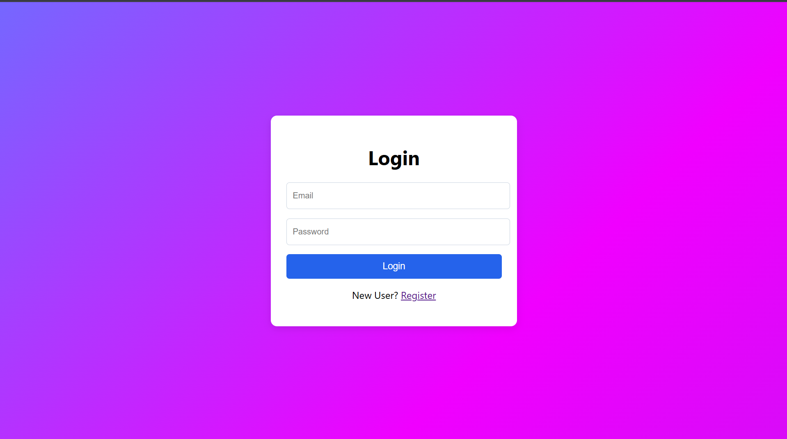
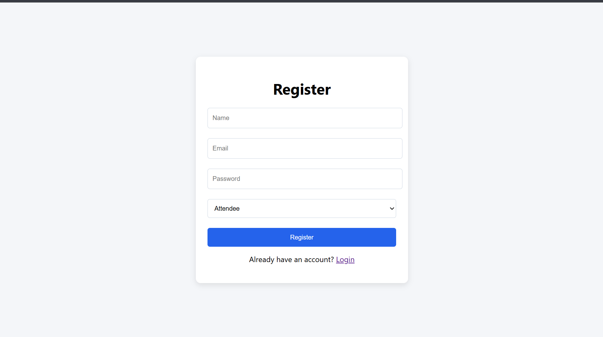
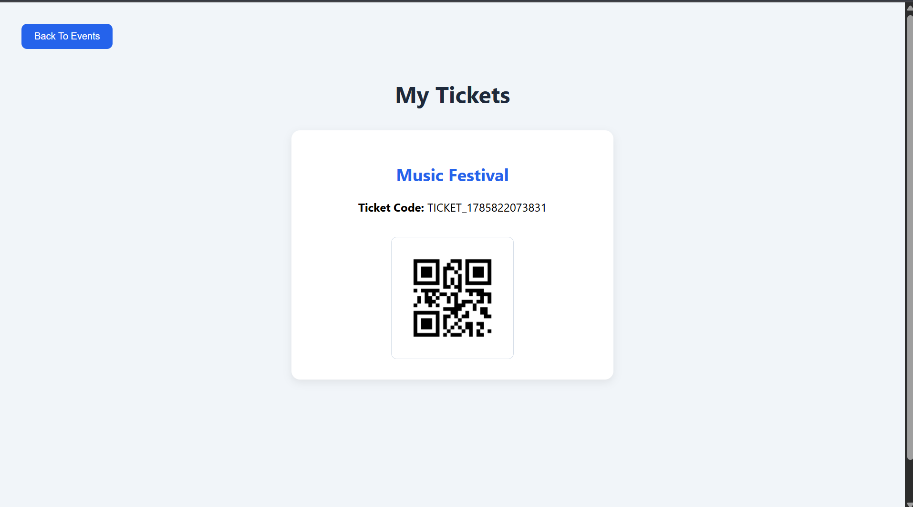

# Event Ticket Booking System

## Description

Event Ticket Booking System is a full-stack web application that allows users to register, log in, create events, manage event details, and book tickets securely.

## Features

- User Registration
- User Login Authentication
- JWT Authorization
- Create Events
- Update Events
- Delete Events
- Event Listing
- Ticket Booking
- QR Code Generation
- My Tickets Page
- Notifications
- Change Password Feature

## Tech Stack

### Frontend
- React.js
- React Router
- Axios
- CSS

### Backend
- Node.js
- Express.js
- JWT
- Bcrypt
- QRCode

### Database
- SQLite

## Project Structure

- Frontend
- Backend
- Database

## Screenshots

### Login Page

### Register Page

### Events Page

### My Tickets Page

## Author

Jithender
